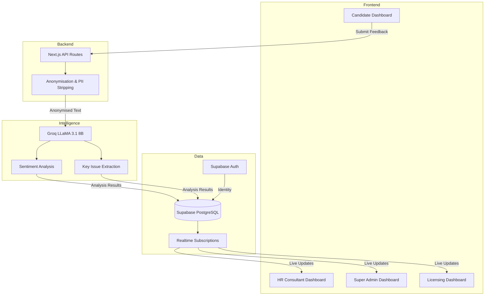

# JSO Candidate Experience Agent

An AI-powered Feedback Intelligence System built for the **JSO (Job Search Optimiser)** platform. This system automates candidate feedback collection, performs sentiment analysis using LLMs, and provides actionable insights across four specialised dashboards.

---

## 🚀 Overview

The **Candidate Experience Agent (CEA)** is a Phase-2 intelligence layer that transforms JSO from a manual consultation service into a data-driven career platform. It captures post-session experiences, uses AI to detect systemic issues, and ensures high quality standards for both candidates and HR consultants.

### Key Pillars
- **Governance**: Transparent scoring and auditable AI decisions.
- **Workers**: Goal-oriented feedback for HR Consultant growth.
- **Customers**: PII-stripped analysis to protect candidate privacy.
- **Sustainability**: Serverless architecture for minimal environmental impact.

---

## 🏗️ Technical Architecture

The project uses a modern serverless stack designed for scalability and real-time interaction.



---

## 🛠️ Tech Stack

- **Frontend**: Next.js 14 (App Router), React, Tailwind CSS, Recharts.
- **Backend**: Next.js Serverless Functions (Node.js).
- **AI/LLM**: Groq Cloud (LLaMA 3.1 8B Instant).
- **Database/Auth**: Supabase (PostgreSQL, RLS, Realtime).
- **Architecture**: Event-driven, Reactive AI Agent.

---

## ✨ Core Features

### 1. Dynamic Onboarding & Signup
- **Auto-Onboarding**: PostgreSQL triggers automatically create a `candidate` profile for any new user signup.
- **Simplified RLS**: Secure yet accessible data policies for demo and production environments.

### 2. Candidate Experience Agent (CEA)
- **Sentiment Analysis**: Blends star ratings with text sentiment to calculate a comprehensive **Satisfaction Score (1-10)**.
- **PII Stripping**: Automatically removes names, emails, and phone numbers before sending data to AI providers.
- **Automated Alerting**: Generates real-time alerts for the Super Admin if a session score falls below the threshold (6/10).

### 3. Specialised Dashboards
- **Candidate**: Interactive surveys and personal satisfaction history.
- **HR Consultant**: Rolling average scores, trend lines, and AI-generated improvement tips.
- **Super Admin**: Platform-wide metrics, consultant leaderboard, and alert management.
- **Licensing**: Aggregate compliance reports and quarterly quality trends.

---

## 🛤️ Data Flow

1. **Trigger**: Consultant marks session as 'Completed'.
2. **Action**: Candidate receives survey popup via Supabase Realtime.
3. **Analysis**: API route cleans data and sends it to Groq LLM.
4. **Scoring**: Blended formula combines explicit rating + implicit sentiment.
5. **Insights**: Results are broadcasted to all dashboards instantly.

---

## 📖 Detailed Setup Guide

### 1. Database Setup (Supabase)
1. Create a new project at [supabase.com](https://supabase.com).
2. Open the **SQL Editor** in your Supabase dashboard.
3. Run the scripts in the `supabase/` directory in this exact order:
   - `migration.sql`: Creates core tables and RLS policies.
   - `onboarding.sql`: Sets up the auto-profile trigger for new users.
   - `fix_rls.sql`: Relaxes security for the demo environment.
   - `seed.sql`: (Optional) Populates the database with demo candidates and sessions.

### 2. Environment Variables
Create a `.env` file in the root directory and add your credentials:
```env
NEXT_PUBLIC_SUPABASE_URL=your_project_url
NEXT_PUBLIC_SUPABASE_ANON_KEY=your_anon_key
SUPABASE_SERVICE_ROLE_KEY=your_service_role_key
GROQ_API_KEY=your_groq_api_key
```

### 3. Local Development
1. Install dependencies:
   ```bash
   npm install
   ```
2. Start the development server:
   ```bash
   npm run dev
   ```
3. Open [http://localhost:3000](http://localhost:3000) in your browser.

### 4. Vercel Deployment
1. Connect your GitHub repository to Vercel.
2. Add the 4 environment variables listed above in the Vercel project settings.
3. Deployment will happen automatically on every push to `master`.

